[](https://www.python.org/)
[](https://arxiv.org/abs/2503.13745)

# FedVSR: Towards Model-Agnostic Federated Learning in Video Super-Resolution


This is the official repository for **FedVSR** which contains code and experiments, a method to train Video Super-Resolution (VSR) models under the Federated Learning (FL) paradigm. The goal is to enable high-quality VSR while ensuring data privacy by not centralizing raw video data.

📄 Read the Arxiv preprint [here](https://arxiv.org/abs/2503.13745)

## Update

**15 January 2026:** 🎉 This work has been accepted at the ACM Multimedia Systems (MMSys) 2026.


## Key Contributions

✅ Introduced a **model-agnostic and stateless FL framework** for VSR

✅ Developed a **3D Discrete Wavelet Transform-based loss function** to preserve high-frequency details and enhance reconstruction quality.

✅ Proposed a **loss-aware weighted aggregation** method.

✅ Achieved superior PSNR, SSIM and LPIPS across multiple VSR models and datasets.

✅ First framework addressing **Federated Learning for VSR**.


## Project Overview 📹✨

- **What is FedVSR?**  
  FedVSR is a federated training framework that enables multiple clients to collaboratively train a shared video super-resolution (VSR) model **without sharing their raw data**. This approach preserves data privacy and is ideal for scenarios where raw video footage is sensitive. 🔒

<p align="center">
  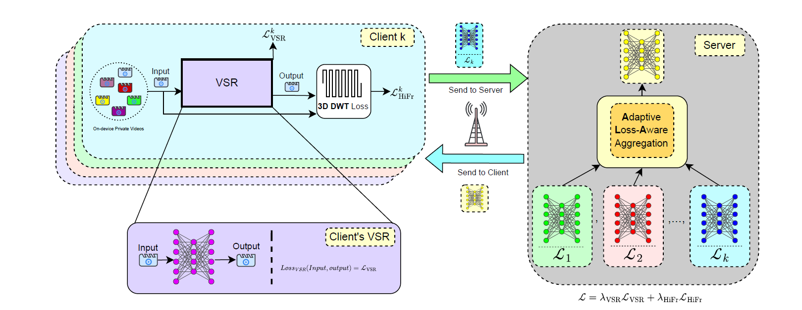
</p>

**Overview of the proposed FedVSR framework:**  
Each client computes an **architecture-agnostic VSR update** augmented with a **DWT-based high-frequency loss**. Clients also track the **average local loss**, which is used for **loss-aware weighted aggregation** at the server. The global model is iteratively refined while maintaining **architecture-agnostic** and **stateless** properties. ⚡


---

## Repository Structure

```
.
├── Kinetics_Scripts/
│   └── copy_movie.py          # Script for extracting & copying related movies
│
├── VRTandRVRT/
│   ├── vrt_and_rvrt_{ALG}.py  # Scripts to run all trainings with different methods.     
│   ├── main_test_{MODEL}      # Scripts to run tests on different models    
│   └── 
│
├── IART/
│   ├── iart_{ALG}.py          # Scripts to run all trainings with different methods.        
│   └── test_scripts/test_*.py # Scripts to run tests  
│
├── requirements.txt      # Python package requirements
└── README.md             # Main documentation
```

---

## Installation & Setup

1. **Clone the repository**
    ```bash
      git clone https://github.com/alimd94/FedVSR.git
      cd FedVSR

2. **Set up Python environment**  
     ```bash
      python3 -m venv fedvsr_env
      source fedvsr_env/bin/activate  
      pip install --upgrade pip
      pip install -r requirements.txt

    

## Prepare Data:

To prepare the dataset, follow [BasicSR](https://github.com/XPixelGroup/BasicSR/blob/master/docs/DatasetPreparation.md#Video-Super-Resolution). After completing the preparation, the directory structure should be as follows: 

```
Path of main dir/
├──REDS/
│   └──train/
│   └────train_sharp
│   └────train_sharp_bicubic/X4
```

## Training

For VRT and RVRT prepare the related json in the file and the run the scripts:
```bash
# VSR trained on FedAvg
python VRTandRVRT/vrt_and_rvrt_fedavg.py
# VSR trained on FedVSR
python VRTandRVRT/vrt_and_rvrt_fedvsr.py
```

For IART:
```bash
# VSR trained on FedAvg
python IART/iart_fedavg.py
# VSR trained on FedVSR
python IART/iart_fedvsr.py
```

## Testing

You can test using 2 different datasets VID4 and REDS:
```bash
python VRTandRVRT/main_test_rvrt.py 

python VRTandRVRT/main_test_vrt.py 
```

To test IART you would use:

```bash
python IART/test_scripts/test_IART_REDS4_N6.py 
python IART/test_scripts/test_IART_Vid4_N6.py
```

## Results 📊

### Quantitative Results

<p align="center">
  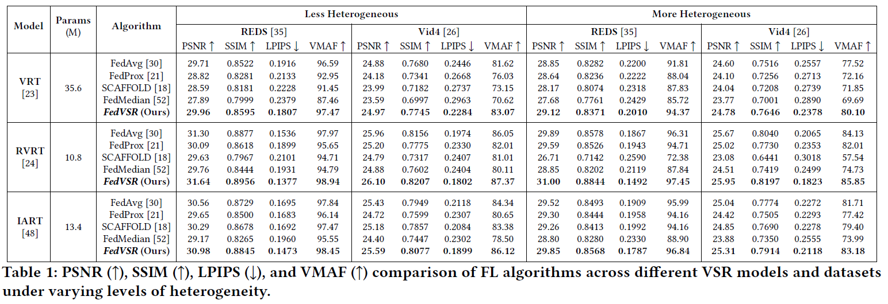
</p>

Comparison of **PSNR (↑), SSIM (↑), LPIPS (↓), and VMAF (↑)** for different federated learning (FL) algorithms across various VSR models and datasets under varying levels of heterogeneity.

<p align="center">
  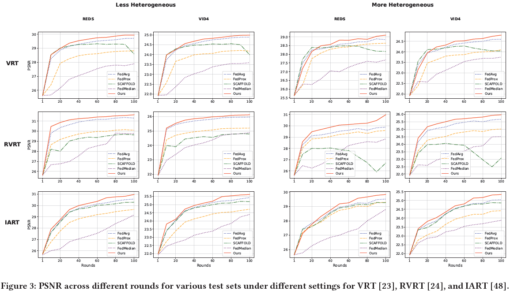
</p>

**PSNR across different rounds** for various test sets under different settings for **VRT, RVRT, and IART**.

<p align="center">
  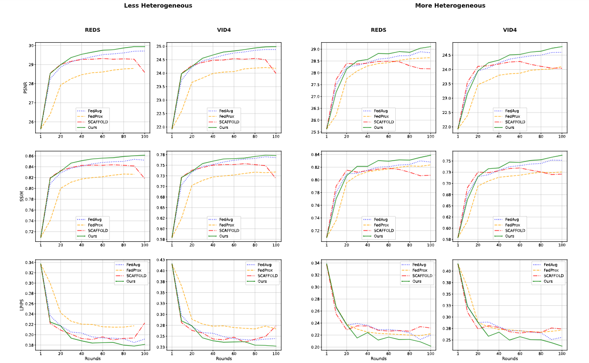
</p>

PSNR, SSIM, and LPIPS values across different rounds for various test sets under different settings for **VRT**.

<p align="center">
  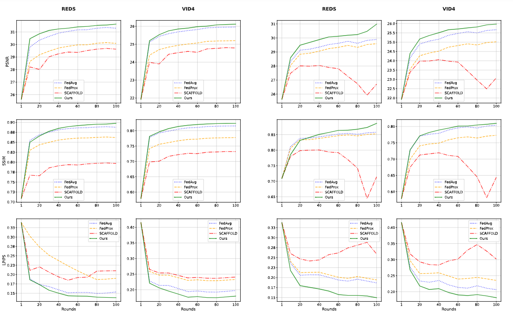
</p>

PSNR, SSIM, and LPIPS values across different rounds for various test sets under different settings for **RVRT**.

<p align="center">
  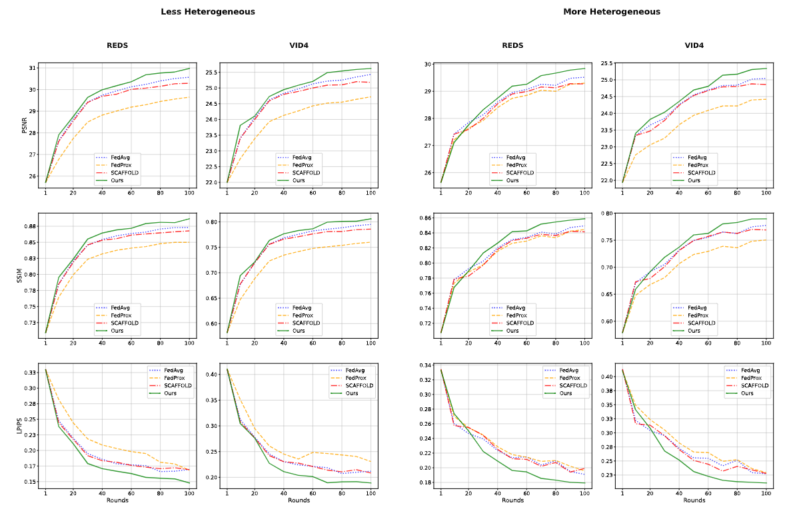
</p>

PSNR, SSIM, and LPIPS values across different rounds for various test sets under different settings for **IART**.


 ### Qualitiative Results

<p align="center">
  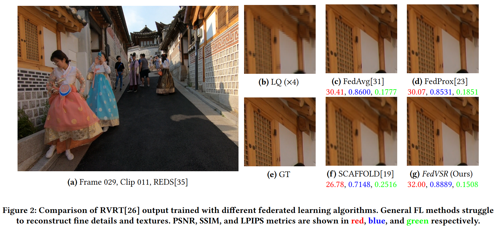
</p>

<p align="center">
  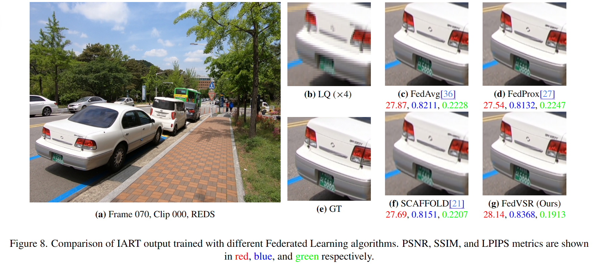
</p>

<p align="center">
  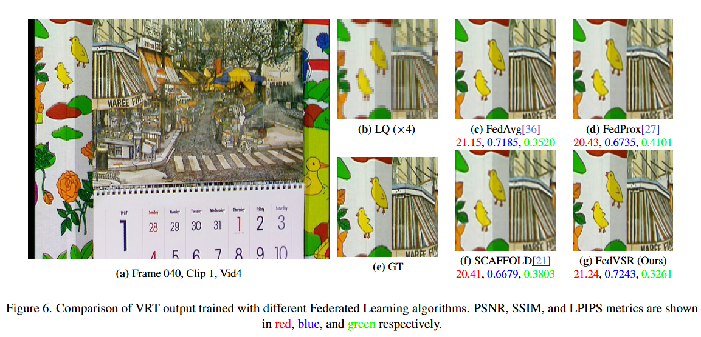
</p>

<p align="center">
  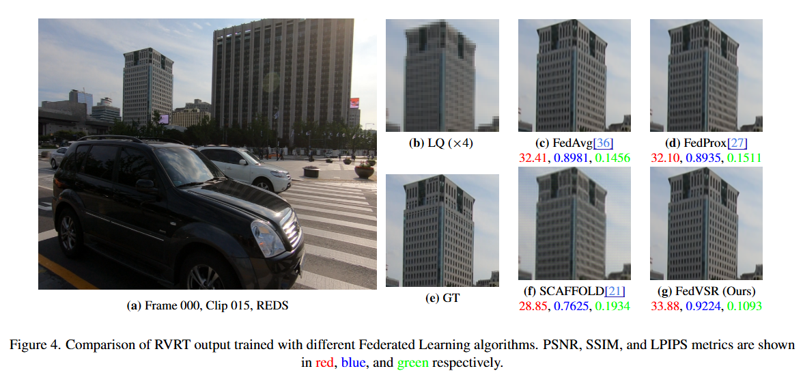
</p>

### Ablation Study 🧪

<p align="center">
  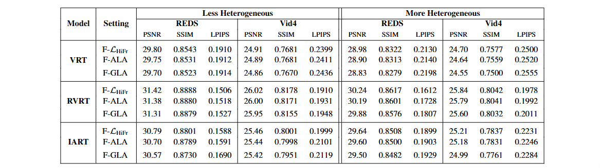
</p>

Ablation study on the impact of **L_HiFr** and **adaptive aggregation** under different heterogeneity settings.

<p align="center">
  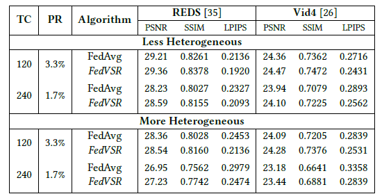
</p>

Extreme test results for **FedAvg** and **FedVSR** under varying heterogeneity settings. Here, **TC** denotes the total number of clients and **PR** denotes the participation rate.

<p align="center">
  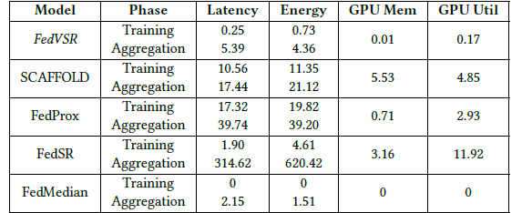
</p>

Computation and memory overhead of different FL methods relative to **FedAvg (%)**. GPU memory and utilization are reported for both **Training** and **Aggregation** phases.

<p align="center">
  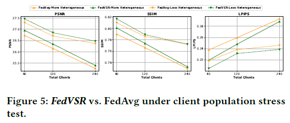
</p>

**FedVSR** vs. **FedAvg** under client population stress tests.

<p align="center">
  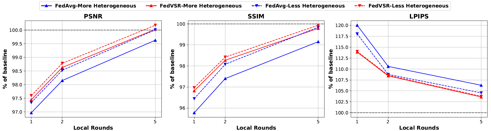
</p>

Effect of **local epochs** on **FedVSR** and **FedAvg** (% of 100-round FedVSR with 1 local epoch).

<p align="center">
  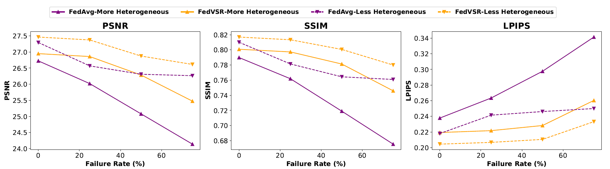
</p>

Impact of **client upload failures** (0–75%) on **FedVSR** vs. **FedAvg**, showing **FedVSR’s higher robustness**.


## Code References

We use the official implementations of the following models:

- **VRT** and **RVRT**:  
  The code for training and evaluating VRT and RVRT models is based on the official [KAIR Repository](https://github.com/cszn/KAIR/tree/master)

- **IART**:  
  The implementation of IART is based on the official code released by [IART Repository](https://github.com/kai422/IART).

- **Federated Learning Framework**:  
  We leverage the [Flower](https://github.com/adap/flower) framework for implementing and managing federated learning workflows.

Please refer to the respective repositories for additional details on model architecture, training strategies, and original paper references.


## Citation 📚

```bibtext
@inproceedings{dehaghi2025fedvsrmodelagnosticfederatedlearning,
  author = {Ali Mollaahmadi Dehaghi and Hossein KhademSohi and Reza Razavi and Steve Drew and Mohammad Moshirpour},
  title = {FedVSR: Towards Model-Agnostic Federated Learning in Video Super-Resolution},
  year = {2026},
  publisher = {Association for Computing Machinery},
  address = {New York, NY, USA},
  url = {https://doi.org/10.1145/3793853.3795752},
  doi = {10.1145/3793853.3795752},
  booktitle = {Proceedings of the 17th ACM Multimedia Systems Conference},
  numpages = {12},
  location = {Hong Kong, Hong Kong},
  series = {MMSys '26}
}
```

## Citing & Supporting

If you find this work useful, please consider ⭐ starring the repository and citing our paper! 😊

