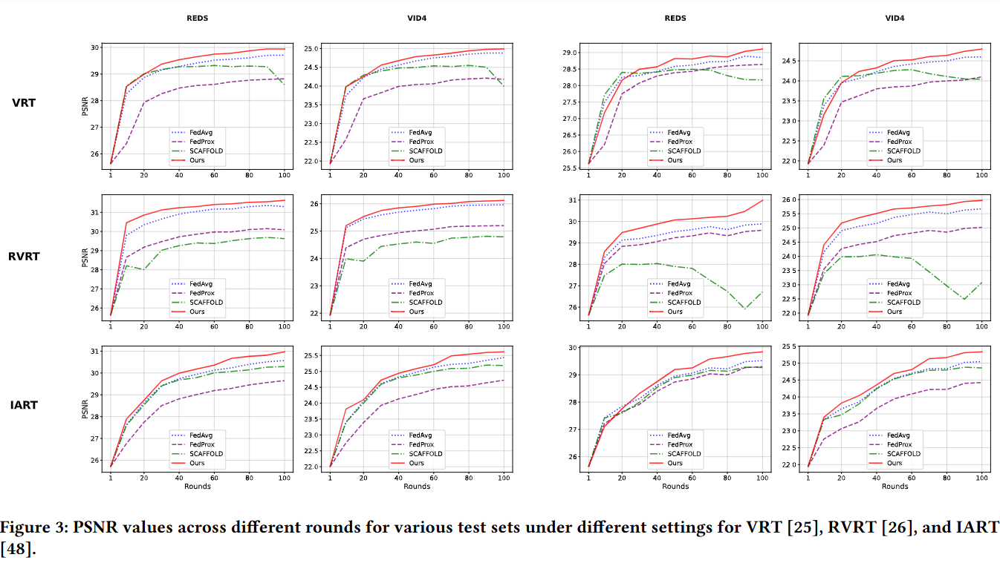
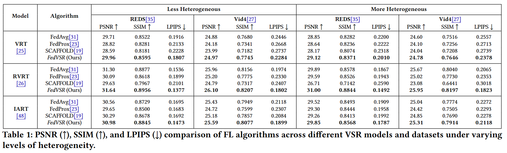
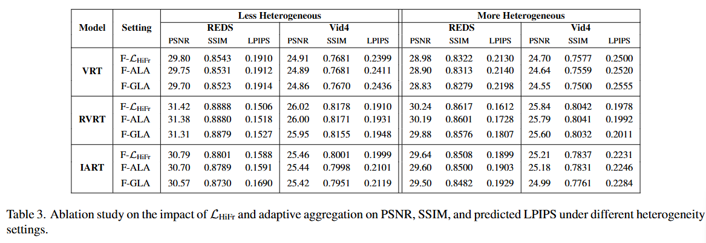
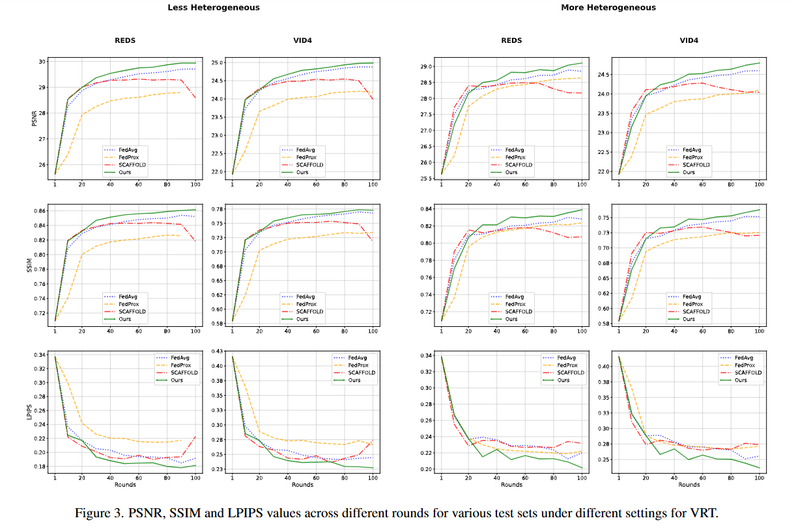
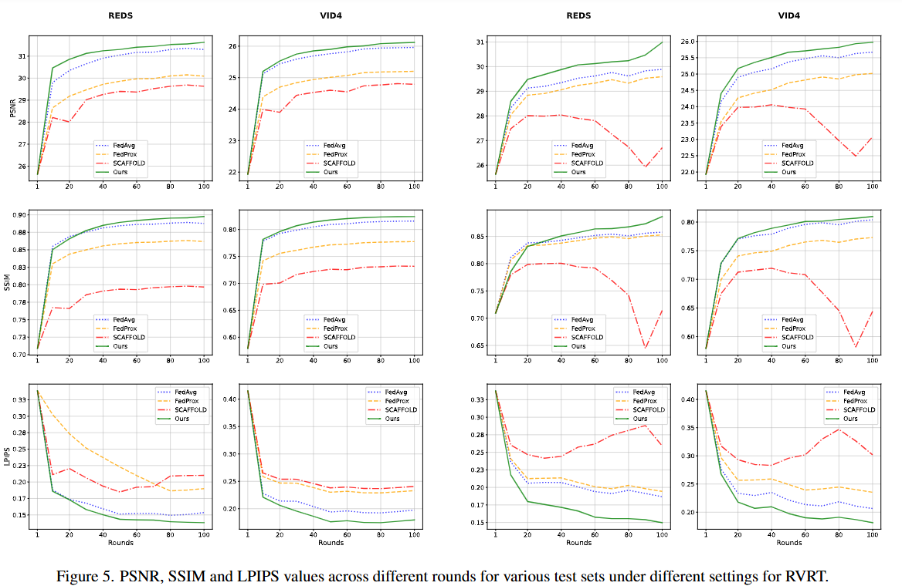
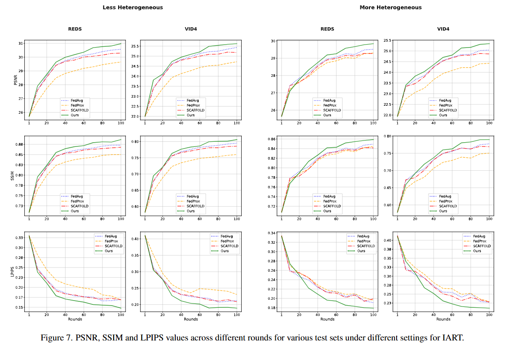

[](https://www.python.org/)
# FedVSR: Towards Model-Agnostic Federated Learning in Video Super-Resolution


This is the official repository for **FedVSR** which contains code and experiments, a method to train Video Super-Resolution (VSR) models under the Federated Learning (FL) paradigm. The goal is to enable high-quality VSR while ensuring data privacy by not centralizing raw video data.


## Key Contributions

✅ Introduced a **model-agnostic and stateless FL framework** for VSR

✅ Developed a **3D Discrete Wavelet Transform-based loss function** to preserve high-frequency details and enhance reconstruction quality.

✅ Proposed a **loss-aware weighted aggregation** method.

✅ Achieved superior PSNR, SSIM and LPIPS across multiple VSR models and datasets.

✅ First framework addressing **Federated Learning for VSR**.


## Project Overview

- **What is FedVSR?**  
  FedVSR is a federated training framework that allows multiple clients to train a shared video super-resolution model without sharing their raw data. This approach preserves data privacy and is suitable for scenarios where raw video footage is sensitive.

<p align="center">
  
</p>


> *Note: This code is released under review status; therefore, no direct citations are referenced in this repo.*

---

## Repository Structure

```
.
├── Kinetics_Scripts/
│   └── copy_movie.py          # Script for extracting & copying related movies
│
├── VRTandRVRT/
│   ├── vrt_and_rvrt_{ALG}.py  # Scripts to run all trainings with different methods.     
│   ├── main_test_{MODEL}      # Scripts to run tests on different models    
│   └── 
│
├── IART/
│   ├── iart_{ALG}.py          # Scripts to run all trainings with different methods.        
│   └── test_scripts/test_*.py # Scripts to run tests  
│
├── requirements.txt      # Python package requirements
└── README.md             # Main documentation
```

---

## Installation & Setup

1. **Clone the repository**
    ```bash
      git clone https://github.com/alimd94/FedVSR.git
      cd FedVSR

2. **Set up Python environment**  
     ```bash
      python3 -m venv fedvsr_env
      source fedvsr_env/bin/activate  
      pip install --upgrade pip
      pip install -r requirements.txt

    

## Prepare Data:

To prepare the dataset, follow [BasicSR](https://github.com/XPixelGroup/BasicSR/blob/master/docs/DatasetPreparation.md#Video-Super-Resolution). After completing the preparation, the directory structure should be as follows: 

```
datasets/
├──REDS/
│   └──val_REDS4_sharp
│   └──val_REDS4_sharp_bicubic
```

## Training

For VRT and RVRT prepare the related json in the file and the run the scripts:
```bash
# VSR trained on FedAvg
python VRTandRVRT/vrt_and_rvrt_fedavg.py
# VSR trained on FedVSR
python VRTandRVRT/vrt_and_rvrt_fedvsr.py
```

For IART:
```bash
# VSR trained on FedAvg
python IART/iart_fedavg.py
# VSR trained on FedVSR
python IART/iart_fedvsr.py
```

## Testing

You can test using 2 different datasets VID4 and REDS:
```bash
python VRTandRVRT/main_test_rvrt.py 

python VRTandRVRT/main_test_vrt.py 
```

To test IART you would use:

```bash
python IART/test_scripts/test_IART_REDS4_N6.py 
python IART/test_scripts/test_IART_Vid4_N6.py
```

## Results

<p align="center">
  
</p>

<p align="center">
  
</p>

<p align="center">
  
</p>

<p align="center">
  
</p>

<p align="center">
  
</p>

<p align="center">
  
</p>

<p align="center">
  
</p>

<p align="center">
  
</p>
<p align="center">
  
</p>
<p align="center">
  
</p>


## Code References

We use the official implementations of the following models:

- **VRT** and **RVRT**:  
  The code for training and evaluating VRT and RVRT models is based on the official [KAIR Repository](https://github.com/cszn/KAIR/tree/master)

- **IART**:  
  The implementation of IART is based on the official code released by [IART Repository](https://github.com/kai422/IART).

- **Federated Learning Framework**:  
  We leverage the [Flower](https://github.com/adap/flower) framework for implementing and managing federated learning workflows.

Please refer to the respective repositories for additional details on model architecture, training strategies, and original paper references.


## Citation

This work is currently under review. A formal citation will be added once the review process is complete.  In the meantime, feel free to ⭐ star the repository if you find it helpful! 😊
